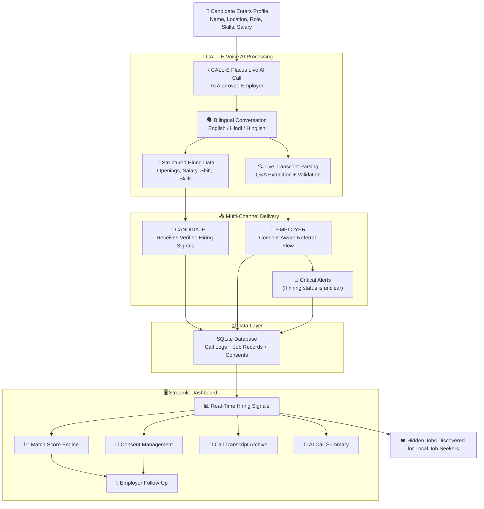

# 🤖 JobJugaadu AI (जॉब जुगाड़ AI)

> **A smart, zero-friction job discovery engine for local job seekers, powered by CALL-E voice AI.**

JobJugaadu AI is an AI-powered phone-call agent that helps discover hidden local job opportunities by calling approved employers, collecting structured hiring information, and matching it with candidate preferences. By leveraging CALL-E's state-of-the-art voice AI, we transform offline hiring conversations into structured, consent-aware job matches.

---

## 🎥 Demo Video

> 🎬 **Video coming soon!** I'm currently recording a walkthrough of JobJugaadu AI in action. Check back shortly, or follow me on [Twitter/X](https://x.com/vishalsingh2972) to get notified when it's live.

---

## 🧠 Why I Built This

Growing up in India, I've seen how many talented people miss out on great local job opportunities simply because they don't know they exist. Small businesses hire through walk-ins, referrals, and phone calls—not online portals. Meanwhile, job seekers spend hours scrolling through stale listings that never show these hidden openings.

I built **JobJugaadu AI** to bridge this gap. I wanted to prove that AI voice technology could turn a simple phone call into a structured, verified job discovery engine—one that respects both the employer's time and the candidate's consent.

This project is part of my journey exploring how **voice AI + LLMs** can solve real-world problems for Indian users, especially those who prefer Hindi or Hinglish over English.

---

## Architecture Diagram



---
## 📌 Project Overview

When a candidate enters their job profile and clicks **Find Hidden Jobs**, the system forks into a structured discovery pipeline:

1. **To Candidate (Immediate & Interactive):** Delivers verified hiring signals from real employer conversations, including openings, salary, shift, skills, and joining timeline.
2. **To Employer (Consent-Aware):** Collects explicit permission for candidate referrals and future follow-ups, ensuring every interaction is consent-driven.
3. **Critical Alert Tier (Outcome Escalation):** If a call outcome is unknown or unverified, the system blocks automatic retries and flags the result for manual review—preventing wasted calls and protecting employer relationships.
4. **Match Engine Layer (Candidate Only):** Calculates a match score based on role, salary, shift, skills, and hiring status—helping candidates prioritize the best opportunities.

**JobJugaadu AI** is an event-driven asynchronous pipeline that bridges offline hiring conversations with structured, verified job data.

---

## 👩‍💼 Real-World Example: Adil (Vadodara) & Metro Warehouse

> "Adil is a fresher in Vadodara looking for a warehouse job. He's tired of scrolling through online portals that never show local openings. He opens **JobJugaadu AI**, enters his profile—name, location, preferred role as *Warehouse Assistant*, expected salary ₹15,000, and day shift.
> He clicks **Find Hidden Jobs**. The system identifies **Metro Warehouse** as an approved employer and places a live AI call.
> Within 90 seconds, the AI assistant introduces itself: *'Hello, this is JobJugaadu AI assistant. Which language would you prefer for this conversation, English or Hindi?'*
> The employer chooses Hindi. The AI asks about current hiring, openings, salary, shift, skills, and joining timeline—one question at a time.
> Adil's dashboard updates instantly with verified results: **2 openings, ₹16,000–₹18,000 salary, Night shift, Packing + Inventory skills, Immediate joining**.
> *Scenario B (Consent Flow):* Adil clicks **I'm Interested**. The system asks whether JobJugaadu AI may share his profile with Metro Warehouse. Only after his explicit approval does the employer follow-up become eligible.
> From that day onward, Adil has a verified, structured job lead that never appeared on any online portal—discovered through a natural phone conversation."

---

## 💭 The Problem Space

For millions of local job seekers in India, finding work is a constant struggle:

* **Hidden Opportunities:** Many small and local businesses hire through walk-ins, referrals, and phone calls instead of publishing openings online.
* **Information Asymmetry:** Job seekers miss nearby opportunities even when employers are actively hiring—simply because the signal never reaches them.
* **Language Barriers:** Job seekers and employers often prefer Hindi or Hinglish, but most job platforms are English-first.
* **Consent & Trust:** Automated outreach can feel intrusive. Without explicit consent and AI disclosure, both candidates and employers lose trust.
* **Unverified Data:** Online job listings are often stale or fake. A live phone call provides real-time, verified hiring signals.

---

## 🧠 Core System Processing Lifecycle

```txt
[Candidate Profile Input] ──> [Streamlit Dashboard] ──> (Profile Ready) ──> [Approved Employer Selection]
                                                                                        │
                                                                                        ▼
                                                                              [CALL-E Voice Agent]
                                                                                        │
                                   ┌────────────────────────────────────────────────────┴────────────────────────────────────────────────────┐
                                   ▼ (Live Call)                                                                                            ▼
                         [Bilingual AI Conversation]                                                                              [Call Outcome Unknown]
                         (English / Hindi / Hinglish)                                                                             (Retry Blocked)
                                   │                                                                                                    │
                                   ▼                                                                                                    ▼
                         [Live Transcript Parsing]                                                                             [Manual Review Flag]
                         (Q&A Extraction + Validation)                                                                          (No Auto-Retry)
                                   │
                                   ▼
                         [Structured Hiring Data]
                         (Openings, Salary, Shift, Skills)
                                   │
                         [SQLite Persistence]
                         (Call Logs + Job Records)
                                   │
                  ┌────────────────┴────────────────┐
                  ▼ (Verification)                  ▼ (Match Engine)
        [Verified Hiring Signals]          [Match Score Calculation]
                  │                                  │
                  └────────────────┬─────────────────┘
                                   ▼
                         [Candidate Consent Flow]
                                   │
                                   ▼
                         [Employer Follow-Up]
                         (Only After Approval)

```

---

## 🛠️ Tech Stack & Engineering Rationale

| Architecture Layer | Technology | Engineering Selection Reason |
| --- | --- | --- |
| **Frontend Platform** | **Streamlit** | Rapid Python UI development with real-time session state. |
| **Voice AI Engine** | **CALL-E** | Industry-standard AI phone calling with live transcripts. |
| **Prompt Engineering** | **Custom Python** | Bilingual (English/Hindi) conversation flow with accuracy rules. |
| **Result Parsing** | **Regex + NLP Heuristics** | Extracts structured data from live transcripts with Hindi/English support. |
| **Data Persistence** | **SQLite** | Lightweight, zero-config relational storage for call logs and jobs. |
| **Validation Layer** | **JSON Schema** | Enforces structured hiring data integrity before display. |
| **Match Engine** | **Scoring Algorithm** | Role, salary, shift, skills, and hiring status weighted scoring. |
| **Safety Controls** | **Custom Python** | Phone masking, retry protection, consent management, AI disclosure. |
| **Environment Config** | **python-dotenv** | Secure credential and phone number management. |

---

## 📋 Call & State Machine Logic

* **`PROFILE_READY`**: Candidate enters name, location, role, skills, salary, shift, and travel distance.
* **`EMPLOYER_APPROVED`**: Business is checked for authorization, do-not-call status, and valid E.164 phone format.
* **`CALL_PREPARED`**: Idempotency key generated; call record created with masked phone and attempt counter.
* **`CALL_STARTED`**: AI call placed; attempt counter incremented; status set to `in_progress`.
* **`LANGUAGE_SELECTED`**: AI asks employer to choose English or Hindi; entire conversation continues in that language.
* **`PERMISSION_GRANTED`**: Employer gives explicit permission to continue; otherwise call ends politely.
* **`HIRING_CONFIRMED`**: Structured data collected one question at a time—openings, salary, shift, skills, experience, joining.
* **`RESULT_VALIDATED`**: JSON schema validation ensures all required fields and valid enum values.
* **`CALL_COMPLETED`**: Verified result persisted to SQLite; hiring signals displayed to candidate.
* **`OUTCOME_UNKNOWN`**: If call result is ambiguous, automatic retry is blocked to prevent wasted calls.
* **`MATCH_SCORED`**: Match engine calculates score based on role, salary, shift, skills, and hiring status.
* **`CONSENT_APPROVED`**: Candidate explicitly approves profile sharing before any employer follow-up.
* **`FOLLOWUP_ELIGIBLE`**: Employer follow-up only allowed when consent is approved, business permits referrals, and hiring is active.

---

## 🚀 Developer Quick Start

### Use the Service Programmatically

```python
from calle_service import discover_job_from_business

# Discover a job from an approved business
result = discover_job_from_business(
    business_name="Metro Warehouse",
    phone_number="+910000000001",
    candidate_role="Warehouse Assistant"
)

# Result includes structured hiring data
print(result["hiring_status"])        # "hiring_now"
print(result["number_of_openings"])   # 2
print(result["salary_min"])           # 16000
print(result["salary_max"])           # 18000
print(result["shift"])                # "Night"
print(result["skills_required"])      # ["Packing", "Inventory"]
```

### Validate Results

```python
from result_validator import validate_job_result

is_valid, errors = validate_job_result(result)
if not is_valid:
    print("Validation errors:", errors)
```

### Calculate Match Score

```python
from matching import calculate_match_score

score, reasons, label = calculate_match_score(
    result=result,
    preferred_role="Warehouse Assistant",
    candidate_skills={"packing", "inventory"},
    expected_salary=15000,
    preferred_shift="Night"
)
print(f"Match: {score}% — {label}")
```

### Check Follow-Up Eligibility

```python
from follow_up import can_follow_up_with_employer

allowed, reason = can_follow_up_with_employer(
    job_result=result,
    candidate_consent="approved"
)
print(f"Follow-up allowed: {allowed} — {reason}")
```

---

## 🔌 API Endpoints (FastAPI)

The `ui_server.py` provides a REST API for programmatic access:

| Method | Endpoint | Description |
| --- | --- | --- |
| `GET` | `/` | Serve the web dashboard |
| `GET` | `/api/config` | Get current mode (demo/live) and business info |
| `POST` | `/api/search` | Submit candidate profile and get approved employer |
| `POST` | `/api/call` | Place AI call and get structured hiring result |
| `POST` | `/api/interest` | Save candidate interest in a job |
| `POST` | `/api/consent` | Save candidate profile-sharing consent |
| `POST` | `/api/reset` | Reset demo data and runtime state |

### Example API Call

```bash
curl -X POST http://localhost:8000/api/call \
  -H "Content-Type: application/json" \
  -d '{
    "name": "Adil",
    "location": "Vadodara",
    "preferred_role": "Warehouse Assistant",
    "skills": "packing, inventory",
    "expected_salary": 15000,
    "shift": "Night",
    "travel_distance": 10
  }'
```

---

## 🛠️ Local Setup

### Prerequisites

- Python 3.10+
- A CALL-E API key (for live mode)

### Installation

```bash
# Clone the repository
git clone https://github.com/vishalsingh2972/jobjugaadu-AI.git
cd jobjugaadu-AI

# Create a virtual environment
python -m venv .venv

# Activate on Windows
.\.venv\Scripts\Activate.ps1

# Activate on macOS/Linux
source .venv/bin/activate

# Install dependencies
pip install -r requirements.txt
```

### Environment Configuration

Create a `.env` file in the project root:

```env
CALLE_API_KEY=your_calle_api_key_here
USE_MOCK_CALLS=true
JOBJUGAADU_TEST_PHONE=+91XXXXXXXXXX
```

- `USE_MOCK_CALLS=true` → Demo mode (no real calls, safe for demos)
- `USE_MOCK_CALLS=false` → Live CALL-E mode (requires valid API key and test phone)

### Run the App

```bash
# Streamlit dashboard
streamlit run app.py

# FastAPI server (alternative UI)
uvicorn ui_server:app --reload
```

---

## 🧪 Testing

```bash
# Run the test suite
pytest tests/
```

The test suite covers:
- Call manager state transitions and retry protection
- Follow-up eligibility logic
- Safety controls (authorization, phone masking)
- Result validation against JSON schema

---

## 🔒 Safety by Design

- Calls are made only to approved or authorized test employers.
- The AI clearly identifies itself as an AI assistant.
- Permission is requested before continuing any conversation.
- No protected or discriminatory questions are asked.
- Missing information is never intentionally fabricated.
- Employer opt-out is respected.
- Candidate profile sharing requires explicit consent.
- Phone numbers and credentials are stored using environment variables.
- Automatic retry is blocked after unknown call outcomes.

---

## 🗺️ Roadmap

Here's what I'm planning next for JobJugaadu AI:

- [ ] **More Indian Languages** — Add Tamil, Telugu, Bengali, and Marathi support
- [ ] **WhatsApp Integration** — Let candidates discover jobs via WhatsApp
- [ ] **More Employer Categories** — Retail, healthcare, logistics, hospitality, and more
- [ ] **Mobile App** — React Native app for on-the-go job discovery
- [ ] **Employer Dashboard** — Let businesses manage their hiring preferences
- [ ] **Analytics Dashboard** — Track call success rates, match accuracy, and user engagement
- [ ] **Community Contributions** — Open up the employer database for community additions
- [ ] **Deployment Guide** — One-click deploy to Streamlit Cloud / Railway / Render

---

## 🤝 Contributing

I'd love your help making JobJugaadu AI better! Here's how you can contribute:

1. **Fork the repository**
2. **Create a feature branch** (`git checkout -b feature/amazing-feature`)
3. **Commit your changes** (`git commit -m 'Add some amazing feature'`)
4. **Push to the branch** (`git push origin feature/amazing-feature`)
5. **Open a Pull Request**

### Ideas for Contributions

- Add new mock businesses with realistic hiring data
- Improve Hindi/Hinglish prompt engineering
- Add more test cases for edge scenarios
- Build a web frontend with React/Next.js
- Add CI/CD pipeline with GitHub Actions
- Write documentation or blog posts about the project

---

## 🚀 What I Learned from this Project

- Building "JobJugaadu AI" taught me that moving from an "idea" to a working prototype involves much more than just writing code; it's about managing the flow between different AI engines and real-world constraints.
- I learned how to stitch together complex pieces—CALL-E for the telephony, custom prompt engineering for the brain, and structured parsing for the data—into one smooth, reliable pipeline.
- Working with Hindi and Hinglish was a massive eye-opener. I had to learn how to handle code-mixing and ensure the AI didn't sound like a robot, which gave me a much deeper appreciation for building multilingual systems for real Indian users.
- I spent a lot of time getting comfortable with safety-by-design. Phone masking, retry protection, and consent management aren't just features—they're the foundation of a trustworthy product.
- This project really drove home the point that engineering isn't just about the tech. In job discovery, the "how" matters just as much as the "what." If the outreach isn't respectful or consent-aware, the data is useless, and I learned to prioritize that human touch in my design.
- Taking this from a concept in my head to a full-stack, functional product was a rewarding journey. It gave me real hands-on experience in how to architect, debug, and deploy an AI-first application.
- I look forward to exploring and working more closely with voice LLMs in my upcoming projects.

---

## ❤️ Built for Local Job Seekers

JobJugaadu AI explores a simple idea:

> **Hidden jobs should be discovered through conversation, not missed through silence.**

One AI call. One verified hiring signal. One matched opportunity.

This prototype demonstrates how voice AI can make local job discovery significantly more accessible for millions of Indian job seekers.

---

## 📬 Connect With Me

I'm passionate about **AI, Voice Technology, and Developer Relations**. Let's connect!

| Platform | Link |
| --- | --- |
| **GitHub** | [github.com/vishalsingh2972](https://github.com/vishalsingh2972) |
| **Twitter/X** | [x.com/vishalsingh2972](https://x.com/vishalsingh2972) |
| **LinkedIn** | [linkedin.com/in/vishalsingh2972](https://linkedin.com/in/vishalsingh2972) |

### My Other Projects

- 🏛️ **[Bolna India](https://github.com/vishalsingh2972)** — Voice-first government form filling in Telugu
- ❤️ **[Dear Comrade](https://github.com/vishalsingh2972)** — AI-powered health link for NRI children and aging parents

---

## ⭐ Support

If you find this project useful, please consider:

- ⭐ **Starring** the repository
- 🐛 **Reporting** issues
- 🤝 **Contributing** code or documentation
- 📣 **Sharing** it with someone who might benefit

Every bit of support helps me build better AI tools for Indian users!