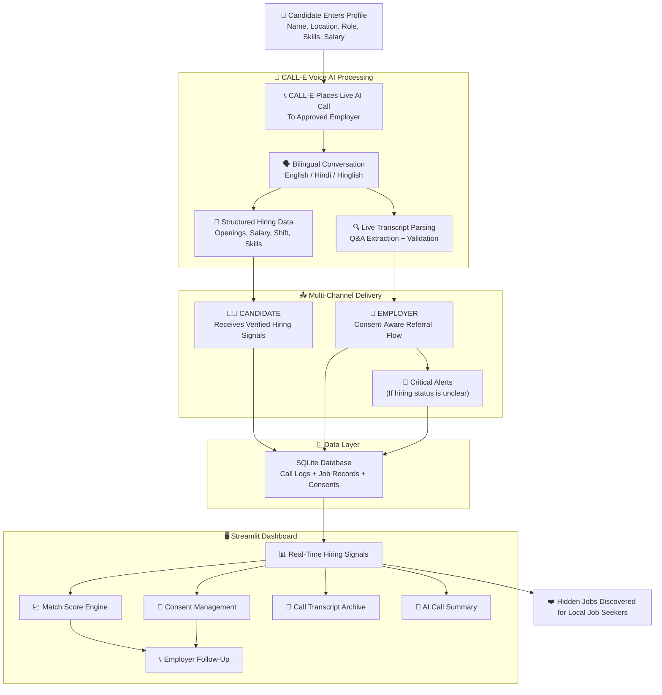

# 🤖 JobJugaadu AI (जॉब जुगाड़ AI)

> **A smart, zero-friction job discovery engine for local job seekers, powered by CALL-E voice AI.**

JobJugaadu AI is an AI-powered phone-call agent that helps discover hidden local job opportunities by calling approved employers, collecting structured hiring information, and matching it with candidate preferences. By leveraging CALL-E's state-of-the-art voice AI, we transform offline hiring conversations into structured, consent-aware job matches.

---
## Architecture Diagram



---
## 📌 Project Overview

When a candidate enters their job profile and clicks **Find Hidden Jobs**, the system forks into a structured discovery pipeline:

1. **To Candidate (Immediate & Interactive):** Delivers verified hiring signals from real employer conversations, including openings, salary, shift, skills, and joining timeline.
2. **To Employer (Consent-Aware):** Collects explicit permission for candidate referrals and future follow-ups, ensuring every interaction is consent-driven.
3. **Critical Alert Tier (Outcome Escalation):** If a call outcome is unknown or unverified, the system blocks automatic retries and flags the result for manual review—preventing wasted calls and protecting employer relationships.
4. **Match Engine Layer (Candidate Only):** Calculates a match score based on role, salary, shift, skills, and hiring status—helping candidates prioritize the best opportunities.

**JobJugaadu AI** is an event-driven asynchronous pipeline that bridges offline hiring conversations with structured, verified job data.

---

## 👩‍💼 Real-World Example: Adil (Vadodara) & Metro Warehouse

> "Adil is a fresher in Vadodara looking for a warehouse job. He's tired of scrolling through online portals that never show local openings. He opens **JobJugaadu AI**, enters his profile—name, location, preferred role as *Warehouse Assistant*, expected salary ₹15,000, and day shift.
> He clicks **Find Hidden Jobs**. The system identifies **Metro Warehouse** as an approved employer and places a live AI call.
> Within 90 seconds, the AI assistant introduces itself: *'Hello, this is JobJugaadu AI assistant. Which language would you prefer for this conversation, English or Hindi?'*
> The employer chooses Hindi. The AI asks about current hiring, openings, salary, shift, skills, and joining timeline—one question at a time.
> Adil's dashboard updates instantly with verified results: **2 openings, ₹16,000–₹18,000 salary, Night shift, Packing + Inventory skills, Immediate joining**.
> *Scenario B (Consent Flow):* Adil clicks **I'm Interested**. The system asks whether JobJugaadu AI may share his profile with Metro Warehouse. Only after his explicit approval does the employer follow-up become eligible.
> From that day onward, Adil has a verified, structured job lead that never appeared on any online portal—discovered through a natural phone conversation."

---

## 💭 The Problem Space

For millions of local job seekers in India, finding work is a constant struggle:

* **Hidden Opportunities:** Many small and local businesses hire through walk-ins, referrals, and phone calls instead of publishing openings online.
* **Information Asymmetry:** Job seekers miss nearby opportunities even when employers are actively hiring—simply because the signal never reaches them.
* **Language Barriers:** Job seekers and employers often prefer Hindi or Hinglish, but most job platforms are English-first.
* **Consent & Trust:** Automated outreach can feel intrusive. Without explicit consent and AI disclosure, both candidates and employers lose trust.
* **Unverified Data:** Online job listings are often stale or fake. A live phone call provides real-time, verified hiring signals.

---

## 🧠 Core System Processing Lifecycle

```txt
[Candidate Profile Input] ──> [Streamlit Dashboard] ──> (Profile Ready) ──> [Approved Employer Selection]
                                                                                        │
                                                                                        ▼
                                                                              [CALL-E Voice Agent]
                                                                                        │
                                   ┌────────────────────────────────────────────────────┴────────────────────────────────────────────────────┐
                                   ▼ (Live Call)                                                                                            ▼
                         [Bilingual AI Conversation]                                                                              [Call Outcome Unknown]
                         (English / Hindi / Hinglish)                                                                             (Retry Blocked)
                                   │                                                                                                    │
                                   ▼                                                                                                    ▼
                         [Live Transcript Parsing]                                                                             [Manual Review Flag]
                         (Q&A Extraction + Validation)                                                                          (No Auto-Retry)
                                   │
                                   ▼
                         [Structured Hiring Data]
                         (Openings, Salary, Shift, Skills)
                                   │
                         [SQLite Persistence]
                         (Call Logs + Job Records)
                                   │
                  ┌────────────────┴────────────────┐
                  ▼ (Verification)                  ▼ (Match Engine)
        [Verified Hiring Signals]          [Match Score Calculation]
                  │                                  │
                  └────────────────┬─────────────────┘
                                   ▼
                         [Candidate Consent Flow]
                                   │
                                   ▼
                         [Employer Follow-Up]
                         (Only After Approval)

```

---

## 🛠️ Tech Stack & Engineering Rationale

| Architecture Layer | Technology | Engineering Selection Reason |
| --- | --- | --- |
| **Frontend Platform** | **Streamlit** | Rapid Python UI development with real-time session state. |
| **Voice AI Engine** | **CALL-E** | Industry-standard AI phone calling with live transcripts. |
| **Prompt Engineering** | **Custom Python** | Bilingual (English/Hindi) conversation flow with accuracy rules. |
| **Result Parsing** | **Regex + NLP Heuristics** | Extracts structured data from live transcripts with Hindi/English support. |
| **Data Persistence** | **SQLite** | Lightweight, zero-config relational storage for call logs and jobs. |
| **Validation Layer** | **JSON Schema** | Enforces structured hiring data integrity before display. |
| **Match Engine** | **Scoring Algorithm** | Role, salary, shift, skills, and hiring status weighted scoring. |
| **Safety Controls** | **Custom Python** | Phone masking, retry protection, consent management, AI disclosure. |
| **Environment Config** | **python-dotenv** | Secure credential and phone number management. |

---

## 📋 Call & State Machine Logic

* **`PROFILE_READY`**: Candidate enters name, location, role, skills, salary, shift, and travel distance.
* **`EMPLOYER_APPROVED`**: Business is checked for authorization, do-not-call status, and valid E.164 phone format.
* **`CALL_PREPARED`**: Idempotency key generated; call record created with masked phone and attempt counter.
* **`CALL_STARTED`**: AI call placed; attempt counter incremented; status set to `in_progress`.
* **`LANGUAGE_SELECTED`**: AI asks employer to choose English or Hindi; entire conversation continues in that language.
* **`PERMISSION_GRANTED`**: Employer gives explicit permission to continue; otherwise call ends politely.
* **`HIRING_CONFIRMED`**: Structured data collected one question at a time—openings, salary, shift, skills, experience, joining.
* **`RESULT_VALIDATED`**: JSON schema validation ensures all required fields and valid enum values.
* **`CALL_COMPLETED`**: Verified result persisted to SQLite; hiring signals displayed to candidate.
* **`OUTCOME_UNKNOWN`**: If call result is ambiguous, automatic retry is blocked to prevent wasted calls.
* **`MATCH_SCORED`**: Match engine calculates score based on role, salary, shift, skills, and hiring status.
* **`CONSENT_APPROVED`**: Candidate explicitly approves profile sharing before any employer follow-up.
* **`FOLLOWUP_ELIGIBLE`**: Employer follow-up only allowed when consent is approved, business permits referrals, and hiring is active.

---

## 🛠️ Local Setup

### Prerequisites

- Python 3.10+
- A CALL-E API key (for live mode)

### Installation

```bash
# Clone the repository
git clone https://github.com/vishalsingh2972/jobjugaadu-AI.git
cd jobjugaadu-AI

# Create a virtual environment
python -m venv .venv

# Activate on Windows
.\.venv\Scripts\Activate.ps1

# Activate on macOS/Linux
source .venv/bin/activate

# Install dependencies
pip install -r requirements.txt
```

### Environment Configuration

Create a `.env` file in the project root:

```env
CALLE_API_KEY=your_calle_api_key_here
USE_MOCK_CALLS=true
JOBJUGAADU_TEST_PHONE=+91XXXXXXXXXX
```
- `USE_MOCK_CALLS=false` → Live CALL-E mode (requires valid API key and test phone)

### Run the App

```bash
# Streamlit dashboard
streamlit run app.py

# FastAPI server (alternative UI)
uvicorn ui_server:app --reload
```

---

## 🧪 Testing

```bash
# Run the test suite
pytest tests/
```

The test suite covers:
- Call manager state transitions and retry protection
- Follow-up eligibility logic
- Safety controls (authorization, phone masking)
- Result validation against JSON schema

---

## 🔒 Safety by Design

- Calls are made only to approved or authorized test employers.
- The AI clearly identifies itself as an AI assistant.
- Permission is requested before continuing any conversation.
- No protected or discriminatory questions are asked.
- Missing information is never intentionally fabricated.
- Employer opt-out is respected.
- Candidate profile sharing requires explicit consent.
- Phone numbers and credentials are stored using environment variables.
- Automatic retry is blocked after unknown call outcomes.

---

## ❤️ Built for Local Job Seekers

JobJugaadu AI explores a simple idea:

> **Hidden jobs should be discovered through conversation, not missed through silence.**

One AI call. One verified hiring signal. One matched opportunity.

This prototype demonstrates how voice AI can make local job discovery significantly more accessible for millions of Indian job seekers.- `USE_MOCK_CALLS=false` → Live CALL-E mode (requires valid API key and test phone)

### Run the App

```bash
# Streamlit dashboard
streamlit run app.py

# FastAPI server (alternative UI)
uvicorn ui_server:app --reload
```

---

## 🧪 Testing

```bash
# Run the test suite
pytest tests/
```

The test suite covers:
- Call manager state transitions and retry protection
- Follow-up eligibility logic
- Safety controls (authorization, phone masking)
- Result validation against JSON schema

---

## 🔒 Safety by Design

- Calls are made only to approved or authorized test employers.
- The AI clearly identifies itself as an AI assistant.
- Permission is requested before continuing any conversation.
- No protected or discriminatory questions are asked.
- Missing information is never intentionally fabricated.
- Employer opt-out is respected.
- Candidate profile sharing requires explicit consent.
- Phone numbers and credentials are stored using environment variables.
- Automatic retry is blocked after unknown call outcomes.

---

## ❤️ Built for Local Job Seekers

JobJugaadu AI explores a simple idea:

> **Hidden jobs should be discovered through conversation, not missed through silence.**

One AI call. One verified hiring signal. One matched opportunity.

